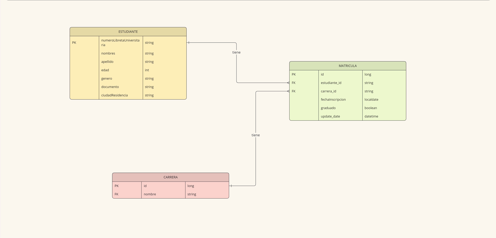
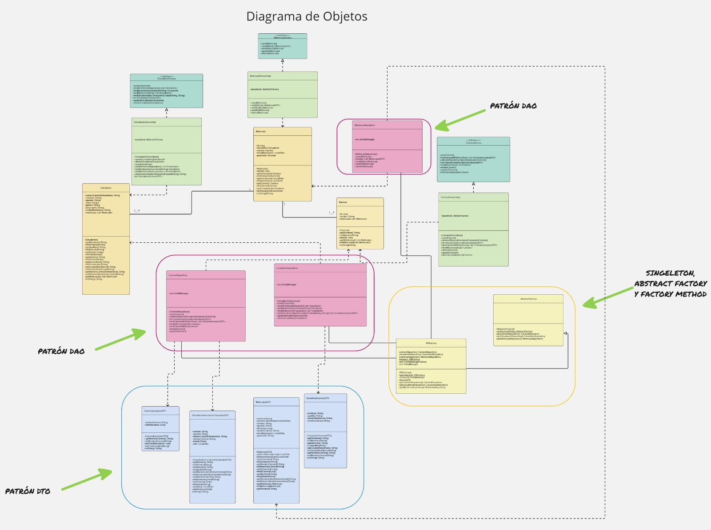

# 📄 Ejercicio integrador tp2

## 🗂 Descripción

Este proyecto implementa un sistema de gestión utilizando PostgreSQL como base de datos. Se incluyen dos documentos para entender mejor el sistema:

- **DereExt**: 
  - [PDF](diagramas/dereExt.pdf)
  - 

- **Diagrama de Clases**: 
  - [PDF](diagramas/diagrama_clases.pdf)
  - 

El sistema permite gestionar información detallada sobre los diferentes elementos que interactúan en el dominio del problema. 

## 🛠 Configuración con Docker

Para facilitar la configuración del entorno de desarrollo, utilizamos `docker-compose` para desplegar tanto la base de datos PostgreSQL como `phpPgAdmin` para la gestión gráfica de la base de datos.

### 🚀 Instrucciones de Uso

**1.** Ejecuta el comando docker-compose para iniciar los contenedores:

 `docker-compose up `

Este comando iniciará dos contenedores:

PostgreSQL en el puerto 5432.
phpPgAdmin en el puerto 8080.

**2.** Inicia sesión en `phpPgAdmin` con las siguientes credenciales (definidas en el archivo `docker-compose.yml`):

- **Usuario phpPgAdmin:** `admin@admin.com`
- **Contraseña phpPgAdmin:** `admin`
- **Base de Datos:** `root`
- **Contraseña de Datos:** `root`

**3.** Dentro de `phpPgAdmin`, selecciona la base de datos y luego navega a la pestaña `SQL` para ejecutar el script de datos de prueba.

**4.** Carga y ejecuta el script ubicado en `scripts/init_data.sql` para llenar la base de datos con datos de prueba. Esto añadirá datos de prueba a las tablas definidas en la base de datos.

**5.** Verifica que los datos hayan sido cargados correctamente navegando por las tablas en phpPgAdmin.

## 📧 Contacto
Si tienes alguna pregunta o sugerencia, no dudes en contactarnos a través del correo.

- **Enzo Heredia:** [herediaenzo414@gmail.com](herediaenzo414@gmail.com)
- **Stephanie Godoy:** [sgodoy@alumnos.exa.unicen.edu.ar](sgodoy@alumnos.exa.unicen.edu.ar)
- **Pablo Hernandez:** [pablohrnz9365@gmail.com](pablohrnz9365@gmail.com)
